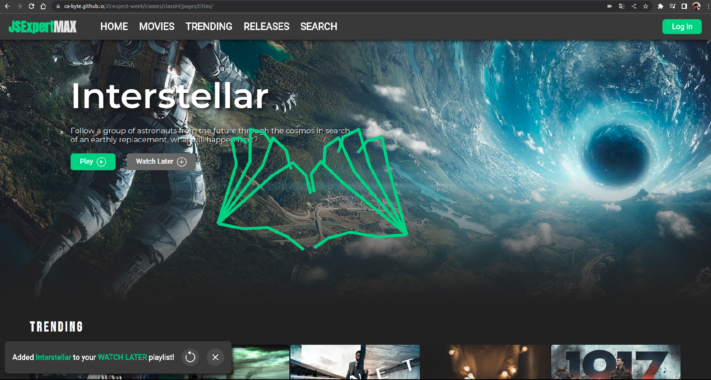

<p align="center" id="top">
  
</p>

<br>


<p align="center">
	<a href="#memo-project">Project</a>&nbsp;&nbsp;&nbsp;|&nbsp;&nbsp;&nbsp;
	<a href="#features">Features</a>&nbsp;&nbsp;&nbsp;|&nbsp;&nbsp;&nbsp;
	<a href="#rocket-technologies">Technologies</a>&nbsp;&nbsp;&nbsp;|&nbsp;&nbsp;&nbsp;
	<a href="#clipboard-requirements">Requirements</a>&nbsp;&nbsp;&nbsp;|&nbsp;&nbsp;&nbsp;
	<a href="#links">Links</a>&nbsp;&nbsp;&nbsp;|&nbsp;&nbsp;&nbsp;
	<a href="#faq">FAQ</a>&nbsp;&nbsp;&nbsp;|&nbsp;&nbsp;&nbsp;
	<a href="#keyboard-how-to-run-the-project">How to run the project </a>&nbsp;&nbsp;&nbsp;|&nbsp;&nbsp;&nbsp;
	<a href="#art-layout">Layout</a>&nbsp;&nbsp;&nbsp;|&nbsp;&nbsp;&nbsp;
</p>

<br>

---

## :memo: Project 

One of the highlights was class 01, where we explored the ability to reproduce and pause videos with just the blink of an eye. It was mind-blowing to see how multithreading in the browser can make this possible.

In class 02, we delved into the fascinating world of gesture recognition and how we can use it to interact with web applications in new and exciting ways.

class 03 was all about unleashing our creativity with canvas, learning how to draw and click on elements based on their x and y coordinates.

And finally, in class 04, we even got to hack the browser to simulate mouse events, opening up a whole new world of possibilities for web developers.


This is a project developed during Semana JS Expert 7.0 **[JSExpert Max Gesture Controller](https://semana.javascriptexpert.com.br/)**, run by Erick Wendel.

## Features ##
- TODO List
  - [x] - The search field should not crash when typing the search term
  - [x] - It should draw hands on screen and make background elements still clickable 🙌
  - [x] - Should trigger scroll up when using open palm 🖐
  - [x] - Must trigger scroll down when using closed palm ✊
  - [x] - Must trigger click on nearest element when using pinch gesture 🤏🏻
  - [x] - When moving elements on the screen, it should trigger the event**:hover** in elements in context

- Video Player
  - [x] - It should be possible to play or pause videos in the blink of an eye 😁
  - [x] - All machine learning processing must be done through a web worker
	
## Links: ##
- All links used in [references](./referencias.md)

<br>


---

## :rocket: Technologies ##

This project was developed using the following technologies:

- [HTML](https://developer.mozilla.org/en-US/docs/Web/HTML)
- [CSS](https://developer.mozilla.org/en-US/docs/Web/CSS)
- [Javascript](https://developer.mozilla.org/en-US/docs/Web/JavaScript)
- [TensorFlow](https://blog.tensorflow.org/2020/11/iris-landmark-tracking-in-browser-with-MediaPipe-and-TensorFlowJS.html)
- [Workers API](https://blog.tensorflow.org/2020/11/iris-landmark-tracking-in-browser-with-MediaPipe-and-TensorFlowJS.html)
- [Module Workers](https://web.dev/module-workers/)

<br>

---

## :clipboard: Requirements

Before starting you need :checkered_flag:, have installed the [Git](https://git-scm.com) e [Node](https://nodejs.org/en/).
- This project was created using Node.js v19.6
- Ideally, you should use the project in a Unix (Linux) environment. If you are on Windows, it is recommended to use [Windows Subsystem Linux](https://www.omgubuntu.co.uk/how-to-install-wsl2-on-windows-10) as Linux commands are shown in classes that may not exist on Windows.

<br>

## FAQ ##
- browser sync is throwing errors on Windows and never boots:
  - Solution: Replace browser sync with http server.
    1. install **http-server** with `npm i -D http-server`
    2. in package.json, delete all `browser-sync` commands and replace them with `npx http-server .`
    3. Now the project will be running on :8080 so go to the browser and try accessing http://localhost:8080/
  The only thing is that the project won't restart when you change some code, you have to press F5 on the page every time you change something
---

## :keyboard: How to run the project ##

```bash
# Clone this project
$ git clone git@github.com:Ca-byte/JS-expect-week.git

# Access
$ cd javascript-expert07-week

# Restore the packages
$ npm ci

# Run the project
$ npm start

# The server will initialize in the <http://localhost:3000/>

```
<br>

## :art: Layout ##

- Project based interface [Streaming Service](https://codepen.io/Gunnarhawk/pen/vYJEwoM) from [gunnarhawk](https://github.com/Gunnarhawk)
  
- <p lign="center">Give a peek at the project [Here](https://ca-byte.github.io/JS-expert-week/classes/class04/pages/titles/)
</p>

---

<br>
<p align="center">Developed with 💜 by Caroline Vieira</p>

<a href="#top">☝</a>

